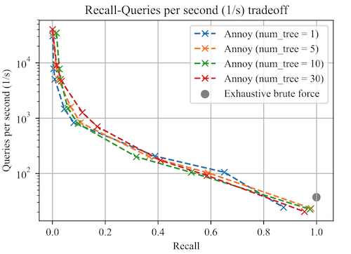

# 🎸Implicit Feedback Modeling for Music Recommendation

In this project, we utilized the Spark engine to build and evaluate a music recommender system. Relying on implicit feedback modeling, we conducted experiments on building the baseline model and did hyperparamter tuning on the rank of latent factors, regularization parameter and the scaling for handling implicit feedbacks. Further, we evaluated several modification strategies on implicit feedback data and the efficiency gain achieved on accelerated query search from utilizing spatial data structure by using the Annoy package.

## Algorithm

In this project, we intend to build a latent factor model to decompose the user-item interaction matrix into a product of user factor matrix *U* and item factor matrix *V* that consist of embeddings for users and items in a common vector space.

Alternating Least Squares (ALS), an iterative algorithm, is applied to generate the user and item embedding matrices. After initializing *U* and *V* , at each iteration, we fix one matrix and solve the other matrix by least squares. Next, the newly-updated factor matrix is held constant to optimize the other matrix. The iterative steps will be repeated until convergence.

Spatial trees utilize recursive partitioning on dataset to accelerate the searching speed for each query by reducing the time complexity from *O*(*n*) to *O*(log *n*). In terms of the brute-force method, we generated the list of top 500 recommended items by computing the dot products between one user and each item, which would be ranked by values to determine item relevance. The recom- mendation results are regarded as ground-truth, which will serve as the benchmark to calculate recall scores when we use the Annoy package.

## Implementation

**Dataset** Our training dataset contains full histories for 1 million users and partial histories for 11 thousand users. The validation and test set consist of the remaining partial histories for those 11 thousand users. Each row in the dataset represents one interaction between the user and item. Namely, the datasets consist of three columns — `user id`, `count`, `track id` where `count` is an integer always greater than 0.

**Data Preprocessing** For this project, we used PySpark to preprocess the data and built the model. Because of the limited computing resources, we chose to downsample the previous 1 million users histories in the training dataset to 20% and appended the partial histories for 11 thousand users together as our new training set. We also employed `StringIndexer` to transform the columns into indicies before feeding them to the ALS model.

**ALS** To estimate the user and item matrices, we used the implementation of ALS from Spark’s machine learning library MLlib (pyspark.ml) that can run in parallel. After fitting the ALS model, we made top 500 item predictions for on the validation and test set and retrieved the latent factors for users and items.

## Files

- full-script.py

  Contain the full executable python codes that can be run in PySpark, including codes on baseline model, alternative model formualtions, hyper parameter tuning, generalization on test set and retrieve the latent factors

- fast-search.py

  Contain the codes for utilizing ``annoy`` package to accelerate query search

## Evaluation

* **Precision at *k***: This is a measure of how many of the predicted items are truly relevant, i.e. appear in the true relevant items set, regardless of the ordering of the recommended items. The mathematical definition is the following

  
  
* **Mean Average Precision (MAP)**: This is also a measure of how many of the predicted items also appear in the true relevant items set. However, the MAP score accounts for the order of the recommender. It will impose higher penalty for highly relevant items not being recommended with high relevance by the model, *i.e.* the item appears near the end of recommender list or even doesnt appear in the list. The mathematical definition is the following:

  
